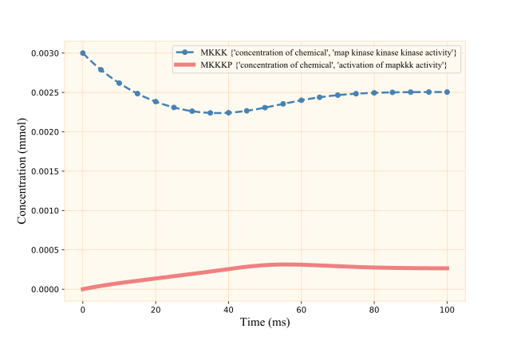
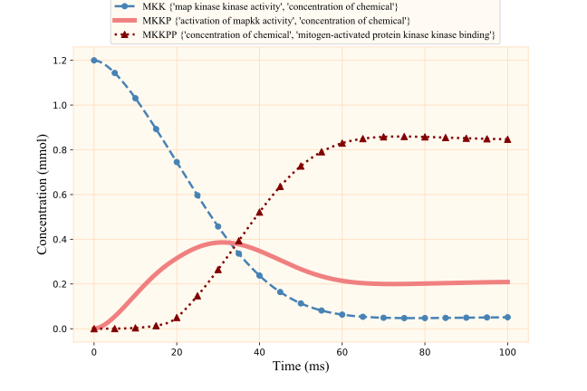
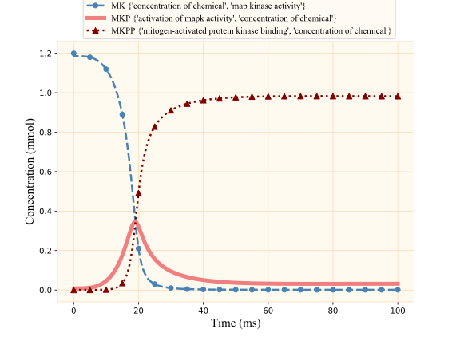
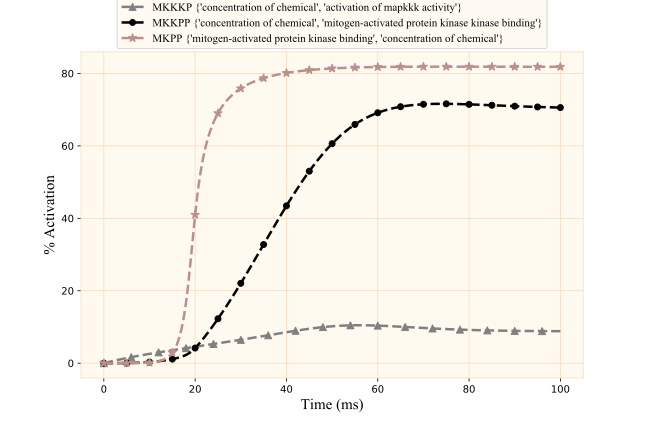

.. Automated Model Composition master file, created by
   sphinx-quickstart on Mon Dec 1 16:22:42 2020.
   You can adapt this file completely to your liking, but it should at least
   contain the root `toctree` directive.

=======================================================
    **Mitogen-activated Protein Kinase (MAPK) Cascade**
=======================================================

The Mitogen-activated Protein Kinase (MAPK) cascade is a signalling pathway, which activates in respond to a stimulus and amplifies the input signal [1_ , 2_]. It contributes in multiple biological processes. The cascade consists of three layers (five cycles in total) as in Figure 2. 

.. figure:: _images/MAPK_cascade.jpg
    :width: 600px
    :align: center
    :height: 470px
    :alt: alternate text
    :figclass: align-center

    Figure 2. Layers and cycles in the MAPK cascade. (A) MAPK pathway in biology. An stimulus (the input Kinase) triggers the signalling from a receptor in the extracellular environment to the nucleus of the cell; (B) utilising the same bond graph template module for the cycles. Each cycle is connected to other cycles if they have species in common.

The repetitive structure in the cycles makes the MAPK cascade a suitable example of reusabilty [2]_. Here, as mentioned in :ref:`The_approach`, we demonstrate the automated generation of the whole cascade, using the bond graph template of one cycle. Once the annotated variables along with their values are extracted from the CellML models and we have the symbolic bond graph template, the remainder will be a generic composition method for any given model(s).

The following is the description of the utilised functions and modules in the Jupyter Notebook.

Python libraries
================

The required libraries are as follows:

* General:
.. code-block:: Python

   import copy
   import difflib
   import numpy as np

* Bond graphs:
.. code-block:: Python

   import BondGraphTools as bgt
   

* Data Extraction:
.. code-block:: Python

   import rdflib
   from lxml import etree
   import pandas
   import re
   import xml.etree.ElementTree as ET
   import os

* Plotting:
.. code-block:: Python

   import matplotlib.pyplot as plt
   from matplotlib import markers
   import matplotlib.font_manager as font_manager
   import matplotlib.colors
   from pylab import rcParams

Ontologies
==========
.. role:: python(code)
    :language: py

As for the ontologies, we have downloaded and saved the required ones in :python:`.csv` format from `bioportal <https://bioportal.bioontology.org/ontologies>`_. 

.. code-block:: Python

   FMA = pandas.read_csv('FMA.csv')
   CHEBI = pandas.read_csv('CHEBI.csv')
   OPB = pandas.read_csv('OPB.csv')
   GO = pandas.read_csv('GO.csv')

The description of these ontologies is given in Table 1.
      
   +------------+--------------------------------------------+
   | Ontology   | Description                                |
   +============+============================================+
   | *FMA*      | Foundational Model of Anatomy              |
   +------------+--------------------------------------------+
   | *OPB*      | Ontology of Physics for Biology            |
   +------------+--------------------------------------------+
   | *CHEBI*    | Chemical Entities of Biological Interest   |
   +------------+--------------------------------------------+
   | *GO*       | Gene Ontology                              |
   +------------+--------------------------------------------+

   Table 1. Ontologies' description.

* Extraction of the Class IDs and Labels from the ontologies (:python:`.csv` files). The Class IDs are codes particular to each entity and the Preferred Labels are the meanings of the codes. These are extracted and saved in separate lists for later references.
.. code-block:: Python

   fmaID = FMA['Class ID']
   fmaLabel= FMA['Preferred Label']
   chebiID = CHEBI['Class ID']
   chebiLabel= CHEBI['Preferred Label']
   opbID = OPB['Class ID']
   opbLabel= OPB['Preferred Label']
   goID = GO['Class ID']
   goLabel= GO['Preferred Label']

Functions
========

.. function:: catRecognition()

   Asking for the category and location of the models given to the function. Here just the choice of MAPK cycles is included.

   :rtype: [:python:`categories`] list of the categories in which each CellML model fits.
   :rtype: [:python:`addresses`] list of the locations of the CellML files.

This function repeatedly asks the user to insert the location and category of the CellML files. Each CellML file includes the annotated variables of a Mapk cycle. The function stops getting inputs when the user indicates that no further files are going to be added.

The locations must be inserted similar to the one below:

.. code-block:: Python

   /Users/nsh/Documents/modelCompos/MAPKcascade/MAPK_L1.cellml

.. warning::

   Make sure you do not put the addresses in quotation marks!

::

 [categories,addresses]=catRecognition()
 Please select the category of the models according to the following list:
  
  MAPK ==> insert "m"

  Enter the category of the model : m
  Enter the location address for the corresponding file : /Users/nsha457/Documents/Jupyter_files/Annot_Merging/MAPK cascade/MAPK_L1.cellml
  More reactions?(Y/N)y
  Enter the category of the model : m
  Enter the location address for the corresponding file : /Users/nsha457/Documents/Jupyter_files/Annot_Merging/MAPK cascade/MAPK_L2.cellml
  More reactions?(Y/N)n
  

.. function:: getAnnotations(add)

   Extracting the annotations from the CellML files.

   :param add: the list of locations (addresses) which is the output from the "catRecognition" function.
   :rtype: [:python:`List`] a dictionary containing the names of the variables in the CellML files (in the order of the found annotations).
   :rtype: [:python:`annotations`] a dictionary containing the annotations in the CellML files.
   :rtype: [:python:`root`] a dictionary containing the imported XML data from the CellML files.

.. function:: valExtraction(root)

   Extracting the variables and values from the CellML files.

   :param root: a dictionary containing the imported XML data from the output of the "getAnnotations" functions.
   :rtype: [:python:`els`] (representing the elements) a dictionary containing the names of the variables in the CellML files (in the order of the  found initial amounts).
   :rtype: [:python:`init`] (representing the initials) a dictionary containing the initial amounts of the variables in the CellML files.

Figure 3 illustrates how the annotations and values are extracted from the CellML file for an instance substrate (MKKK).

.. figure:: _images/cellml_ex.jpg
    :width: 900px
    :align: center
    :height: 600px
    :alt: alternate text
    :figclass: align-center

    Figure 3. Extraction of the annotations and values from the CellML files. 

In the following script the two above functions (:python:`getAnnotations`, :python:`valExtraction`) are used to extract the annotations, variable names, and their values. For instance, all the annotations of all the files will be saved in ONE dictionary (:python:`annotationsMAPKunsorted`) as :python:`annotationsMAPKunsorted={'0':{...,...,...}, '1':{...,...,...}, ...}`

.. code-block:: Python

   listMAPK={}; annotationsMAPKunsorted={}; rootMAPK={}; elementsMAPK={}; initialsMAPK={}; 
   for i in range(len(categories)):
       if categories[i][0] == 'm':
        [listMAPK[str(i)],annotationsMAPKunsorted[str(i)],rootMAPK[str(i)]]=getAnnotations(addresses[i])        
        [elementsMAPK[str(i)],initialsMAPK[str(i)]]=valExtraction(rootMAPK[str(i)])
                
       else: # For later adding other categories
           pass

At this point, we need to define our symbolic bond graph model:
::

  model=bgt.new(name='MAPK Cascades')

.. function:: mapkModelMaker(Model,annotations)

   Generating the MAPK cycles' bond graph symbolic components.

   :param Model: the symbolic bond graph model.
   :param annotations: a dictionary containing the annotations in the CellML files.
   :rtype: [:python:`mapkCascades`] a dictionary containing some sub-dictionaries in which the annotations for each cycle are given as references.
   :rtype: [:python:`connectivityMatrixx`] the connectivity matrix (a list) for one MAPK cycle.
   :rtype: [:python:`mergeableComponents`] a list of potential mergeable components along with their corresponding junctions.
   :rtype: [:python:`Components`] a dictionary containing the symbolic bond graph components for each inserted module
   :rtype: [:python:`newAnnot`] a dictionary containing the annotations in the CellML files in which the keys are substituted with the identified cycle numbers.

Figure 4 shows how ``newAnnot`` (the output of the ``mapkModelMaker``) is generated by the cycle detection script in ``mapkModelMaker`` function.

.. figure:: _images/cycle_detection.jpg
    :width: 750px
    :align: center
    :height: 1000px
    :alt: alternate text
    :figclass: align-center

    Figure 4. Cycle detection role in the ``mapkModelMaker`` function. 

.. function:: checkMutual(category,annotations,List,els,init)
   
   Checking for similar annotations among the models. If the variables with the same annotations have the same values the function ignores them. Otherwise, it asks the user to choose just one value for the two same variables. If no amount is inserted by the user, the function arbitarary deletes one of them.

   :param category: a list of the names of the categories which each model corresponds to.
   :param annotations: a dictionary containing the annotations for each model (keys are the cycle numbers).
   :param List: list of variable names corresponding to the annotations in order of the "annotations" dictionary.
   :param els: a dictionary containing the names of the variables in the CellML files (in the order of the  found initial amounts).
   :param init: a dictionary containing the initial amounts of the variables in the CellML files.
   :rtype: [:python:`commonAnnots`] common annotations found among the models. Keys will be the pairs of cycles' numbers (k1,k2).
   :rtype: [:python:`init`] The modified dictionary of the initial values.

.. note::

   :python:`annotations` and :python:`List` have the same order of elements.

.. note::

   :python:`els` and :python:`init` have the same order of elements.

Figure 5 depicts the workflow of the ``checkMutual`` fucntion.

.. figure:: _images/checkMutual.jpg
    :width: 500px
    :align: center
    :height: 900px
    :alt: alternate text
    :figclass: align-center

    Figure 5. The workflow of the ``checkMutual`` fucntion and how the mutual annotations are dealt with.
 

The following script shows how the function finds common annotations, gives the corresponding cycles (:python:`(0,1)`), and the different values (:python:`0.35 and 0.77`). The preferred value can be either of the found values or any other amount.

.. code-block:: Python

   [commonAnnots,initialsMAPK]= checkMutual(categories,annotationsMAPK,listMAPK,elementsMAPK,initialsMAPK)

   Different values found for: 

   ['concentration of chemical', 'thermodynamic constant', 'activation of mapkkk activity'], (0,1) : 0.35 and 0.77

   Enter the preferred value: 0.77        
 

.. function:: componentConnectivityMatrixRemove(commonAnnots,mergeableComponents,Components,connectivityMatrixx,model)
   
   Deleting the extra components which have similar annotations by knowing the cycle number that they belong to. By having the cycle numbers here, we exactly know which component is deleted from which model. We need to delete *n-1* of each *n* same components throughout the models and keep one.

   :param commonAnnots: a list of common annotations found among the models.
   :param mergeableComponents: a list of potential mergeable components along with their corresponding junctions.
   :param Components: a dictionary containing the default bond graph components for each module.
   :param connectivityMatrixx: the connectivity matrix (a list) for one MAPK cycle.
   :param model: the bond graph model (no components added yet).
   :rtype: [:python:`jointComps`] a list containing the single components to keep from each set of mutual components.
   :rtype: [:python:`model`] the bond graph model (modified list of components added).
   :rtype: [:python:`Components`] a dictionary including the modified components list for each module.
   :rtype: [:python:`initialCMs`] a dictionary including all the connectvity matrices of the modules. It is modified according to the removed components.

Figure 6 demonstrates the procedure of modifying the list of components and the connectivity matrix according to the identified similar annotations between the cycles.

.. figure:: _images/CompCMremove.jpg
    :width: 600px
    :align: center
    :height: 900px
    :alt: alternate text
    :figclass: align-center

    Figure 6. The procedure of modifying the list of components and the connectivity matrix. This is acheived by identifying the similar annotations between the cycles.

.. function:: valueAllocation(annotations,mapkCascades,List,els,init,Model)

   Passing the values to the bond graph components regarding the annotations. Matching with the ones that have already been given in the mapkCascades dictionary for each cycle.

   :param annotations: a dictionary containing the annotations for each model (keys are the cycle numbers).
   :param mapkCascades: the :python:`mapkCascades` dictionary contains the sub-dictionaries in which the annotations for each cycle are given as references.
   :param List: list of variable corresponding to the annotations in order of the :python:`annotations` dictionary.
   :param els: a dictionary containing the names of the variables in the CellML files (in the order of the initial values).
   :param init: a dictionary containing the initial values of the variables in the CellML files.
   :param Model: the bond graph model which now all the required components are added to.
   :rtype: [:python:`stateVarsInitials`] a list containing the annotations and initial values for the "state variables".

.. function:: componentsListConnectivityMatrix(Components)

   Ordering the modified components of the modules in ONE list. The order is the same as in the connectivity matrix in which the rows and columns represent the connections for each component.

   :param Components: the dictionary including the modified components list for each module.
   :rtype: [:python:`connectivityBondsRow`] a list containing all the components of the modules. Based on the order of the components in this list, the connections between the components and modules will be made using the '0's and '1's in the connectivity matrix.

.. function:: connectivityWhole(initialCMs)

   In this function all the modified connectivity matrices of the modules are combined in one matrix.

   :param initialCMs: a dictionary including all the modified connectvity matrices of the modules. 
   :rtype: [:python:`connectivityMatrixWhole`] a matrix in which all the connectivity matrices are put together diagonally. All other elements of the matrix will remain zero.

 

.. function:: addOnesModuleCompos(initialCMs,jointComps,connectivityBondsRow,connectivityMatrixWhole)
 
   Inserting "1"s in the whole connectivity matrix for connections between the modules based on the saved components in :python:`jointComps`.

   :param initialCMs: a dictionary including all the modified connectvity matrices of the modules. 
   :param jointComps: a list containing the single components to keep from each set of mutual components.
   :param connectivityBondsRow: a list containing the whole components of the modules. Based on the order of the components in this list, the connections between the components and modules will be made using the elements of the connectivity matrix.
   :param connectivityMatrixWhole: a matrix in which all the connectivity matrices are put together diagonally.
   :rtype: [:python:`connectivityMatrixWhole`] modified final connectivity matrix with the "1"s added for making connections between the mutual components of the modules.

Figure 7 displays how the modified connectivity matrices of the cycles (modules) are put together in one matrix using the ``connectivityWhole`` function and then additional '1's are added to the matrix to represent the connections between the modules' components (``addOnesModuleCompos`` function).

.. figure:: _images/cmWhole.png
    :width: 700px
    :align: center
    :height: 700px
    :alt: alternate text
    :figclass: align-center

    Figure 7. Creation of the final connectivity matrix. The final matrix both shows the connections between the components of each module and any connections between the modules.

.. function:: BondsConnection(connectivityMatrixWhole,connectivityBondsRow)

   Making the bond graph connections (bonds) between the components based on the final connectivity matrix.

   :param connectivityMatrixWhole: the final connectivity matrix.
   :param connectivityBondsRow: a list containing all the components of the modules.
   :rtype: [:python:`model`] the bond graph model in which the connections between the components as well as the modules has been made.  

.. function:: stateVarsValues(model,stateVarsInitials)

   Matching the model's state variable default names with the annotations and values saved in :python:`stateVarsInitials`. Then, passing the values to the corresponding state variables.

   :param model: the bond graph model.
   :param stateVarsInitials: a list containing the annotations and initial values for the state variables.
   :rtype: [:python:`x0Values`] a list of ordered initial values for the state variables (ordering based on the state variables' annotations).

.. function:: combineDict(x0Values)

   Combining the initial values of the state variables in the format acceptable in BondGraphTools i.e. :python:`{'x_0':value_0, 'x_1':value_1, ...}`.

   :param x0Values: A list of ordered initial values for the state variables (ordered based on the state variables' annotations).
   :rtype: [:python:`x_0`] a dictionary including the state variables along with the values gained from the input(:python:`x0Values`).

We can run the simulation in BondGraphTools using :python:`bgt.simulate`. Here, we have no control variables. 

.. function:: bgt.simulate(model, timespan, control_vars, x0, dt)

   :param model: the bond graph model.
   :param timespan: the time interval for simulation.
   :param control_vars: gives values to any variable/parameter which has remained symbolic as control variable. 
   :param x0: a dictionary with the state variables and their values.
   :param dt: the time steps for solving the constitutive equations of the model.
   :rtype: [:python:`t`] a list containing the time points.
   :rtype: [:python:`x`] an array containing the values for the state variables over time. 

.. code-block:: Python
   
   t_span = [0,100]
   t, x = bgt.simulate(model, timespan=t_span, control_vars={}, x0=x_0, dt=0.1)

To plot the simulation results, check the annotation and number of the state variables using :python:`model.state_vars`. Here, three state variables accompanied by their annotations are shown by calling :python:`model.state_vars`.

.. code-block:: Python
   
   model.state_vars
   {'x_0': (C: {'concentration of chemical', 'map kinase kinase kinase kinase activity'},
  'q_0'),
    'x_1': (C: {'concentration of chemical', 'map kinase phosphatase activity'},
  'q_0'),
    'x_2': (C: {'concentration of chemical', 'protein phosphorylation'}, 'q_0'),
    ...}

The order of the state variables changes if you change the order of inserting the CellML files. Make sure you are selecting the correct state variable by observing their annotations in :python:`model.state_vars`.

In this documentation, five sets of graphs are demonstrated. Figure 8 displays the concentration changes of the Input Kinase (MKKKK).

.. code-block:: Python
   

   rcParams['figure.figsize'] = 9, 6
   plt.rcParams['axes.facecolor'] = 'floralwhite'
   plt.rc('axes',edgecolor='peachpuff')

   font = font_manager.FontProperties(family='Times New Roman',
                                      weight='bold',
                                      style='normal', size=11)

   plt.plot(t,x[:,0],'goldenrod', linewidth='5', label='MKKKK'+' '+str(list(model.state_vars.values())[0][0].name))
   plt.legend(bbox_to_anchor=(1, 1), prop=font )

   plt.grid(color='peachpuff')
   plt.xlabel('Time (ms)', fontweight='bold',family='Times New Roman', fontsize=15)
   plt.ylabel('Concentration (mmol)', fontweight='bold',family='Times New Roman', fontsize=15)

.. note::
   According to the output of :python:`model.state_vars`, the corresponding state variable for MKKKK is :python:`x_0`. So, :python:`x[:,0]` is selected for plotting.

.. figure:: _images/mkkkk.svg
    :width: 700px
    :align: center
    :height: 430px
    :alt: alternate text
    :figclass: align-center

    Figure 8. Concentration changes of the Input Kinase (MKKKK).

.. code-block:: Python

   rcParams['figure.figsize'] = 9, 6
   plt.rcParams['axes.facecolor'] = 'floralwhite'
   plt.rc('axes',edgecolor='peachpuff')
   font = font_manager.FontProperties(family='Times New Roman',
                                   weight='bold',
                                   style='normal', size=11)

   plt.plot(t,x[:,4],'steelblue',marker= 'o',markevery=50,ms=6,linestyle='--',linewidth=2.5, label='MKKK'+' '+str(list(model.state_vars.values())[4][0].name))
   plt.plot(t,x[:,5],'lightcoral', linewidth=5, label='MKKKP'+' '+str(list(model.state_vars.values())[5][0].name))
   plt.legend(bbox_to_anchor=(1, 1), fontsize=8, prop=font)
   plt.grid(color='peachpuff')
   plt.xlabel('Time (ms)', fontweight='bold',family='Times New Roman', fontsize=15)
   plt.ylabel('Concentration (mmol)', fontweight='bold',family='Times New Roman', fontsize=15)

    Figure 9. Concentration changes of MKKK and MKKKP.

.. code-block:: Python

   rcParams['figure.figsize'] = 9, 6
   plt.rcParams['axes.facecolor'] = 'floralwhite'
   plt.rc('axes',edgecolor='peachpuff')
   font = font_manager.FontProperties(family='Times New Roman',
                                   weight='bold',
                                   style='normal', size=11)

   plt.plot(t,x[:,12],'steelblue',marker= 'o',markevery=50,ms=6,linestyle='--',linewidth=2.5,label='MKK'+' '+str(list(model.state_vars.values())[12][0].name))
   plt.plot(t,x[:,13],'lightcoral',linewidth=5 ,label='MKKP'+' '+str(list(model.state_vars.values())[13][0].name))
   plt.plot(t,x[:,16],'maroon',marker= '^',markevery=50,ms=7,linestyle=':',linewidth=2.5, label='MKKPP'+' '+str(list(model.state_vars.values())[16][0].name))
   plt.legend(loc='upper center',bbox_to_anchor=(0.51, 1.18), fontsize=8, prop=font)
   plt.grid(color='peachpuff')
   plt.xlabel('Time (ms)', fontweight='bold',family='Times New Roman', fontsize=15)
   plt.ylabel('Concentration (mmol)',fontweight='bold',family='Times New Roman', fontsize=15)

    Figure 10. Concentration changes of MKK, MKKP, and MKKPP.

.. code-block:: Python

   rcParams['figure.figsize'] = 8, 6
   plt.rcParams['axes.facecolor'] = 'floralwhite'
   plt.rc('axes',edgecolor='peachpuff')
   font = font_manager.FontProperties(family='Times New Roman',
                                   weight='bold',
                                   style='normal', size=11)

   plt.plot(t,x[:,20],'steelblue',marker= 'o',markevery=50,ms=6,linewidth=2.5, linestyle='--', label='MK'+' '+str(list(model.state_vars.values())[20][0].name))
   plt.plot(t,x[:,21],'lightcoral', linewidth='5', label='MKP'+' '+str(list(model.state_vars.values())[21][0].name))
   plt.plot(t,x[:,24],'maroon',marker= '^',markevery=50,ms=7,linestyle=':',linewidth=2.5, label='MKPP'+' '+str(list(model.state_vars.values())[24][0].name))
   plt.legend(loc='upper center',bbox_to_anchor=(0.51, 1.18), fontsize=8, prop=font)
   plt.grid(color='peachpuff')
   plt.xlabel('Time (ms)', fontweight='bold',family='Times New Roman', fontsize=15)
   plt.ylabel('Concentration (mmol)',fontweight='bold',family='Times New Roman', fontsize=15)

    Figure 11. Concentration changes of MK, MKP, and MKPP.

.. code-block:: Python
   
   rcParams['figure.figsize'] = 9, 6
   plt.rcParams['axes.facecolor'] = 'floralwhite'
   plt.rc('axes',edgecolor='peachpuff')
   font = font_manager.FontProperties(family='Times New Roman',
                                   weight='bold',
                                   style='normal', size=11)

   plt.plot(t,100*x[:,5]/x[0,4],'grey',marker= '^',markevery=60,ms=7,linestyle='--',linewidth=2.5, label='MKKKP'+' '+str(list(model.state_vars.values())[5][0].name))
   plt.plot(t,100*x[:,16]/x[0,12],'k',marker= 'o',markevery=50,ms=6,linestyle='--',linewidth=2.5,label='MKKPP'+' '+str(list(model.state_vars.values())[16][0].name))
   plt.plot(t,100*x[:,24]/x[0,20],'rosybrown',marker= '*',markevery=50,ms=9, linestyle='--',linewidth=2.5, label='MKPP'+' '+str(list(model.state_vars.values())[24][0].name))

   plt.legend(loc='upper center',bbox_to_anchor=(0.50, 1.18), fontsize=9, prop=font)
   plt.grid(color='peachpuff')
   plt.xlabel('Time (ms)', fontweight='bold',family='Times New Roman', fontsize=15)
   plt.ylabel("% Activation", fontweight='bold',family='Times New Roman', fontsize=15)

    Figure 12. Activation percentage for MKKKP, MKKPP, and MKPP.

.. [1] Sarma, U., & Ghosh, I. (2012). Oscillations in MAPK cascade triggered by two distinct designs of coupled positive and negative feedback loops. `<http://www.biomedcentral.com/1756-0500/5/287>`_

.. [2] Pan, M. (2020). ............. `<.............>`_

